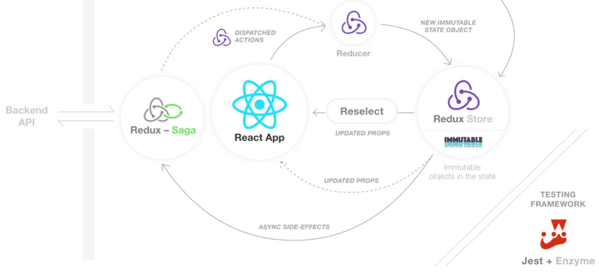

# React单元测试策略

### 常见的react,redux项目架构图

1.actions 测试

2.reducer 测试

3.selector 测试

4.saga 测试

5.component 测试

| 组件类型       | 分支渲染逻辑           | 事件调用  | 纯UI |
| ------------- |:-------------:|:-----:| ----:|
| 展示型业务组件 | ✅ | ✅  | ❌ |
| 容器型业务组件  | ✅ | ✅  | ❌ |
| 通用 UI 组件 | ✅ | ✅  | ❌ |
| 功能型组件 | ✅  | ✅  | ❌ |

6.utils 测试

7.UI 测试