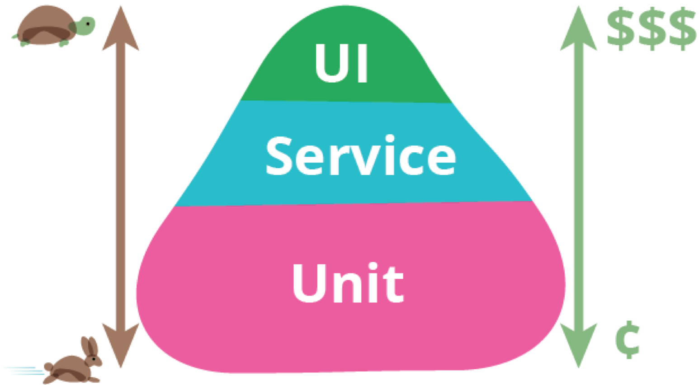

# 测试策略

### 测试金字塔

1.关注业务验收点的端到端测试;

2.关注集成和契约的集成测试和契约测试;

3.关注单元的单元测试。

### 单元测试灵魂-TDD(测试先行)

:::tip
    TDD和单元测试是全有或全无：不做TDD，难以得到好的单元测试；TDD是获得可靠的单元测试的的唯一途径。除此之外别无捷径，想抛开TDD而获得一个好的单元测试套件是迷思，难以成功
:::
